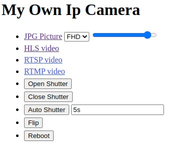
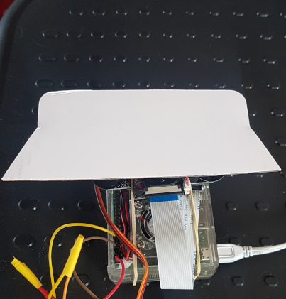
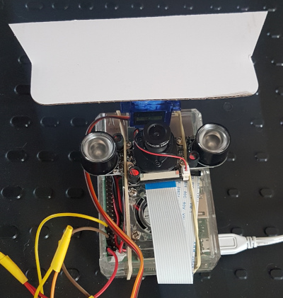

# My Own IP Camera

## Description

A free docker stack to transform a device with camera (+ servomotor) with IP Camera.

## Features

- Go to http://camHostOrIP/ to have URLS and actions
- Video (one size) RTSP + HLS + RTMP "on demand"
- Image (snapshot) directly from camera if possible else from video stream (fhd/hd with choose of quality)
- Shutter (hide the camera) open/close/auto, when auto open the shutter on snapshot and close after (with delay to avoid too openings in case of recording)
- Some possible configurations (especially on shutter, you can deactivate it with env shutter_enabled=false) ; see https://github.com/gallofeliz/js-libs/tree/master/src/config (warning: master to replace to good version)



## Limitations

Currently Raspberry PI with its camera is supported. We can easily isolate the services and have differents images for differents systems.

## Environment

- Raspberry pi 3
- Camera for Raspberry pi
- SG90 servo motor, red cable on A 5.5V pin, brown cable on a ground pin, yellow cable on the GPIO 18 (12th pin) ; installed with something to hide the camera when closed and free the camera when open
- Raspberry pi OS with internet configured and docker engine
- Disable leds (/boot/config.txt)
```
dtparam=act_led_trigger=none
dtparam=act_led_activelow=off
dtparam=pwr_led_trigger=none
dtparam=pwr_led_activelow=off
```

 

## Use (as user)

- You can call http/rtsp/etc endpoints to control and view your camera
- You can use https://github.com/gallofeliz/cameras-images-recorder to register and view pictures from your camera
- You can use any application for that, like MotionEye (https://github.com/motioneye-project/motioneye), VLC, any camera recorder that supports RTSP/HLS/RTMP/JPG camera

## Deploy

`./deploy.sh $camHostOrIp`

## Why not next

- Empty config for rtsp service, the main service will setup and update it
- Various sizing for videos
  - With the same application with ffmpeg to publish to other path ?
  - With endpoint to configure size ?
- Front URLS from API
- Add time/date in frames ?
- Add Onvif endpoint
  - https://github.com/kate-goldenring/onvif-camera-mocking (https://github.com/KoynovStas/onvif_srvd/blob/master/src/onvif_srvd.cpp)
  - https://www.happytimesoft.com/products/onvif-server/index.html
- Detect with accelemeter (or similar) camera position and ajust auto flip
- Add audio
- Isolate internal / public ports ; put rtsp inside the docker image ? Or better separated (logs are better ;)) ?
- Add led to say that cam is used ? Maybe we can use RPI already installed led 
