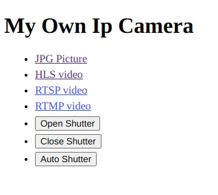

# My Own IP Camera

## Description

A free docker stack to transform a device with camera with IP Camera.

## Limitations

Currently Raspberry PI is supported. We can easily isolate the services and have differents images for differents systems.

## Deploy

`./deploy.sh $camHostOrIp`

## Features

- Go to http://camHostOrIP/ to have URLS and actions
- Video (one size) RTSP + HLS + RTMP "on demand"
- Image (snapshot) directly from camera if possible else from video stream
- Shutter (hide the camera) open/close/auto, when auto open the shutter on snapshot and close after (with delay to avoid too openings in case of recording)

## Why not next

- Empty config for rtsp service, the main service will setup and update it (needed for next)
- Endpoint to reverse camera (flip)
- Improve image snapshot performances (reduce time)
- Various sizing for images (and videos ?)
- State save for flip and others configs
- Add time/date in frames
- Add Onvif endpoint
  - https://github.com/kate-goldenring/onvif-camera-mocking (https://github.com/KoynovStas/onvif_srvd/blob/master/src/onvif_srvd.cpp)
  - https://www.happytimesoft.com/products/onvif-server/index.html
- Detect with accelemeter (or similar) camera position and ajust auto flip
- Add audio
- Add led to say that cam is used

## Disable leds

`sudo bash -c 'echo 0 > /sys/class/leds/led0/brightness'`
`sudo bash -c 'echo 0 > /sys/class/leds/led1/brightness'`